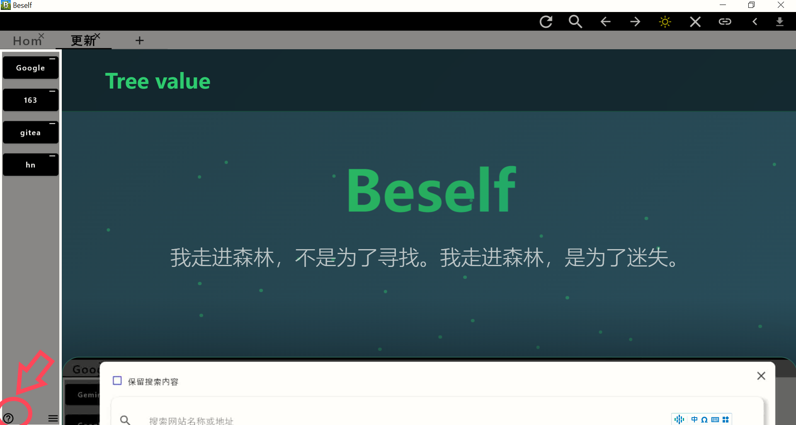

Hope is always good!

How I wish there was a doorway
In the morning, sunlight shines on the grass
The grass forms its seeds, the wind shakes its leaves
We stand without speaking, and it is already beautiful

[Product Release Homepage]:https://heeheeaii.github.io/

/task/tasken.md Long-term tasks are available for this project.

about this application:

main page:

function page:

有希望总是好的！

我多么希望，有一个门口 

早晨，阳光照在草上 

草在结它的种子,风在摇它的叶子 

我们站着不说话,就十分美好

[产品发布主页]:https://heeheeaii.github.io/

/task/task.md 长期有本项目有偿任务发布，有意者可通过发布页下载获取到维护者联系方式。

